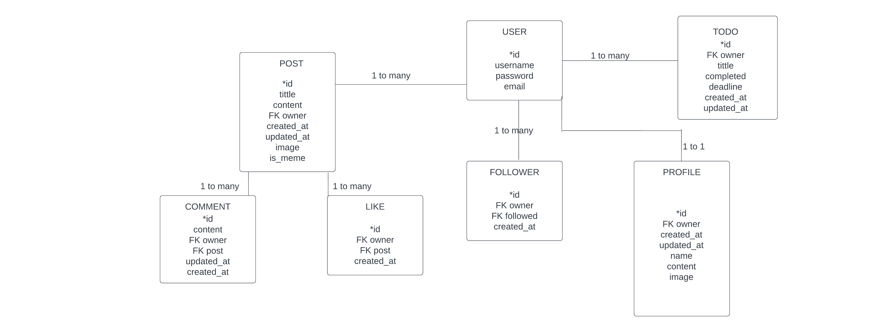
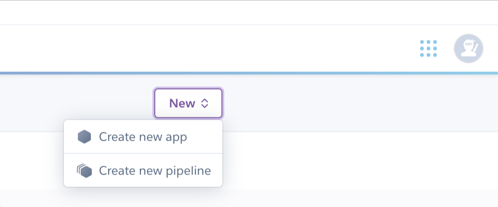
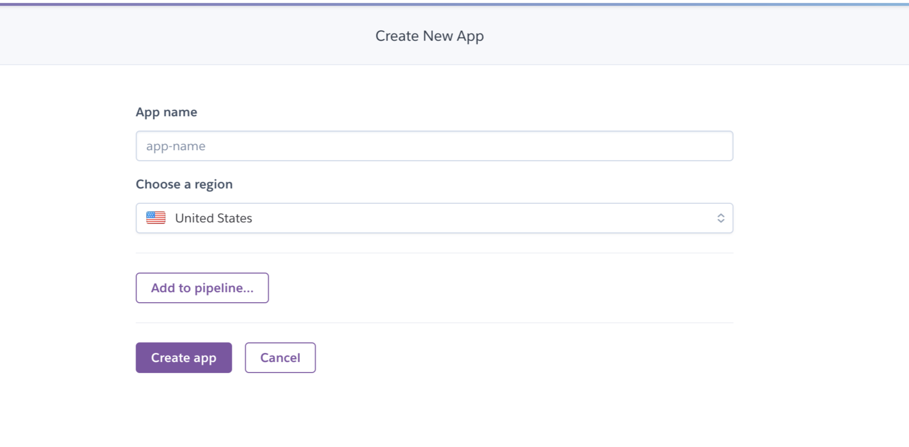
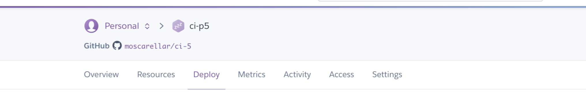
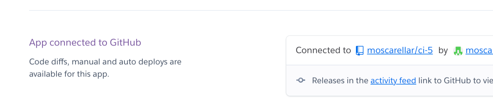

# DRF API

## Table of Contents
1. [User Stories](#user-stories)
2. [Relationship Diagram](#relationship-diagram)
3. [Frameworks & Software](#frameworks--software)
4. [Libraries](#libraries)
5. [Testing](#testing)
   - [Manual Testing](#manual-testing)
6. [Known Bugs](#known-bugs)
7. [Deployment](#deployment)
8. [Credits](#credits)

## User Stories
(Describe the software's features from the end user's perspective)

## Relationship Diagram

This is a diagram that successfully visualized the essential models required for the realization of the front-end project. In addition to employing Django's preexisting user model, I incorporated the subsequent custom models:




## Frameworks & Software

Python

Django Rest 

## Libraries


## Testing

### Manual Testing

- `/auth/users/` POST (User Registration)
- `/auth/token/login/` POST (User Login)
- `/posts/` POST (Create a Post)
- `/comments/` POST (Create a Comment)
- `/posts/<id>/` DELETE (Delete a Post)
- `/posts/<id>/` PUT (Update a Post)
- `/todos/<id>/` GET (Retrieve a Todo)
- `/todos/<id>/` PUT (Update a Todo)
- `/todos/<id>/` DELETE (Delete a Todo)

## `/auth/users/` POST (User Registration)

**Test 1 - Successful Registration**

1. Send a POST request to `/auth/users/` with a unique username, email, and password.
2. Verify that the server responds with a 201 status code and a JSON object containing the new user's details.

**Test 2 - Registration with Existing Username**

1. Send a POST request to `/auth/users/` with a username that already exists in the database.
2. Verify that the server responds with a 400 status code and an error message indicating that the username is already taken.

## `/auth/token/login/` POST (User Login)

**Test 3 - Successful Login**

1. Send a POST request to `/auth/token/login/` with a valid username and password.
2. Verify that the server responds with a 200 status code and a JSON object containing the user's authentication token.

**Test 4 - Login with Invalid Credentials**

1. Send a POST request to `/auth/token/login/` with an incorrect username or password.
2. Verify that the server responds with a 400 status code and an error message indicating that the login credentials are invalid.

## `/posts/` POST (Create a Post)

**Test 5 - Successful Post Creation**

1. Send a POST request to `/posts/` with a valid authentication token and a JSON object containing the post's details.
2. Verify that the server responds with a 201 status code and a JSON object containing the new post's details.

**Test 6 - Post Creation without Authentication**

1. Send a POST request to `/posts/` without an authentication token.
2. Verify that the server responds with a 401 status code and an error message indicating that authentication is required.

## `/comments/` POST (Create a Comment)

**Test 7 - Successful Comment Creation**

1. Send a POST request to `/comments/` with a valid authentication token and a JSON object containing the comment's details.
2. Verify that the server responds with a 201 status code and a JSON object containing the new comment's details.

**Test 8 - Comment Creation without Authentication**

1. Send a POST request to `/comments/` without an authentication token.
2. Verify that the server responds with a 401 status code and an error message indicating that authentication is required.

## `/posts/<id>/` DELETE (Delete a Post)

**Test 9 - Successful Post Deletion**

1. Send a DELETE request to `/posts/<id>/` with a valid authentication token, where `<id>` is the ID of a post created by the authenticated user.
2. Verify that the server responds with a 204 status code, indicating that the post was successfully deleted.

**Test 10 - Post Deletion without Authentication**

1. Send a DELETE request to `/posts/<id>/` without an authentication token.
2. Verify that the server responds with a```markdown
401 status code and an error message indicating that authentication is required.

**Test 11 - Post Deletion by Non-Author**

1. Send a DELETE request to `/posts/<id>/` with a valid authentication token, where `<id>` is the ID of a post created by a different user.
2. Verify that the server responds with a 403 status code and an error message indicating that the user is not authorized to delete the post.

## `/posts/<id>/` PUT (Update a Post)

**Test 12 - Successful Post Update**

1. Send a PUT request to `/posts/<id>/` with a valid authentication token and a JSON object containing the updated post's details.
2. Verify that the server responds with a 200 status code and a JSON object containing the updated post's details.

**Test 13 - Post Update without Authentication**

1. Send a PUT request to `/posts/<id>/` without an authentication token.
2. Verify that the server responds with a 401 status code and an error message indicating that authentication is required.

**Test 14 - Post Update by Non-Author**

1. Send a PUT request to `/posts/<id>/` with a valid authentication token, where `<id>` is the ID of a post created by a different user.
2. Verify that the server responds with a 403 status code and an error message indicating that the user is not authorized to update the post.

## `/todos/<id>/` GET (Retrieve a Todo)

**Test 15 - Successful Todo Retrieval**

1. Send a GET request to `/todos/<id>/` with a valid authentication token, where `<id>` is the ID of a todo created by the authenticated user.
2. Verify that the server responds with a 200 status code and a JSON object containing the todo's details.

**Test 16 - Todo Retrieval without Authentication**

1. Send a GET request to `/todos/<id>/` without an authentication token.
2. Verify that the server responds with a 401 status code and an error message indicating that authentication is required.

**Test 17 - Todo Retrieval by Non-Author**

1. Send a GET request to `/todos/<id>/` with a valid authentication token, where `<id>` is the ID of a todo created by a different user.
2. Verify that the server responds with a 403 status code and an error message indicating that the user is not authorized to view the todo.

## `/todos/<id>/` PUT (Update a Todo)

**Test 18 - Successful Todo Update**

1. Send a PUT request to `/todos/<id>/` with a valid authentication token and a JSON object containing the updated todo's details.
2. Verify that the server responds with a 200 status code and a JSON object containing the updated todo's details.

**Test 19 - Todo Update without Authentication**

1. Send a PUT request to `/todos/<id>/` without an authentication token.
2. Verify that the server responds with a 401 status code and an error message indicating that authentication is required.

**Test 20 - Todo Update by Non-Author**

1. Send a PUT request to `/todos/<id>/` with a valid authentication token, where `<id>` is the ID of a todo created by a different user.
2. Verify that the server responds with a 403 status code and an error message indicating that the user is not authorized to update the todo.

## `/todos/<id>/` DELETE (Delete a Todo)

**Test 21 - Successful Todo Deletion**

1. Send a DELETE request to `/todos/<id>/` with a valid authentication token, where `<id>` is the ID of a todo created by the authenticated user.
2.```markdown
Verify that the server responds with a 204 status code, indicating that the todo was successfully deleted.

**Test 22 - Todo Deletion without Authentication**

1. Send a DELETE request to `/todos/<id>/` without an authentication token.
2. Verify that the server responds with a 401 status code and an error message indicating that authentication is required.

**Test 23 - Todo Deletion by Non-Author**

1. Send a DELETE request to `/todos/<id>/` with a valid authentication token, where `<id>` is the ID of a todo created by a different user.
2. Verify that the server responds with a 403 status code and an error message indicating that the user is not authorized to delete the todo.

## Known Bugs
(List of known issues with the software)

## Deployment
## API Deployment

API Deployment Details:

Server Infrastructure: Heroku used for this task.

In order to deploy this app I went to Heroku https:heroku.com/apps

1. Create a New App

We must click new and create new app.

<details><summary><b>Create New App</b></summary>


</details><br/>

2. Name and Region

Choose a name for your app and choose a region as well.

<details><summary><b>Create App</b></summary>


</details><br/>

3. Deploy Tab

Find Deploy Tab, click on it.

<details><summary><b>Deploy</b></summary>


</details><br/>

4. Connect to Github

Connect to Github so we can choose our repository to deploy.
Search repository by name. After is found click on the deploy button.

<details><summary><b>Connect</b></summary>


</details><br/>


Environment Configuration: We need to configure variables, network settings, and install dependencies that will help us connect with the API securely.

The Axios file we find in the project, is a JavaScript library used to make HTTP requests. We will use it to make requests to the deployed API from our React application.


## Credits
(Acknowledgments for help received during the project's development)